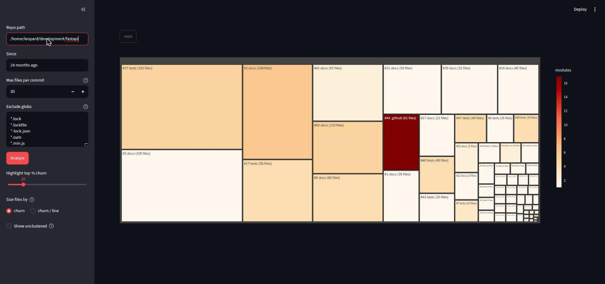
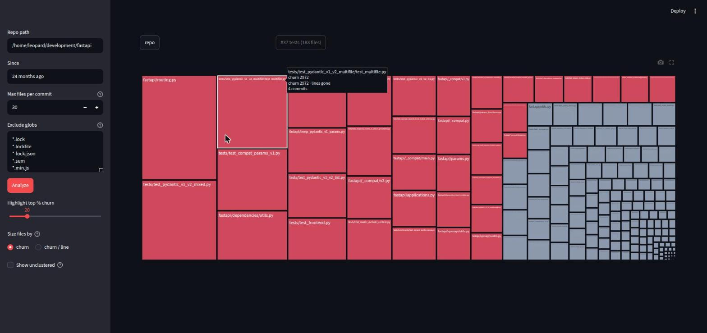
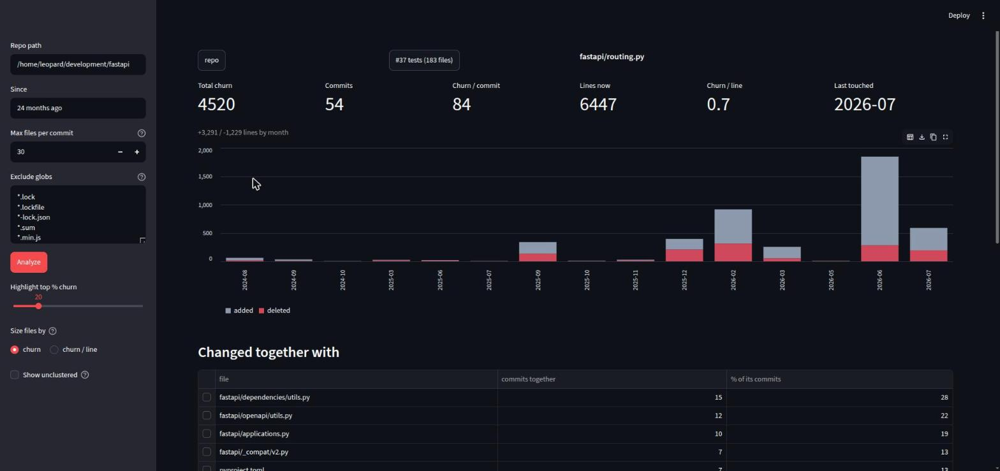
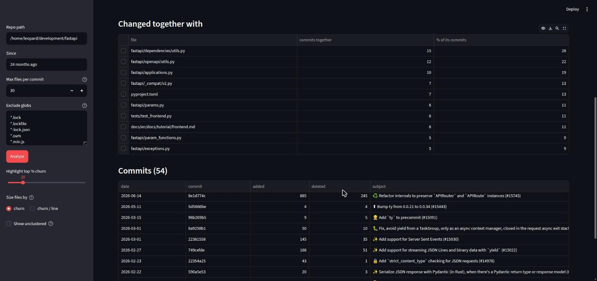
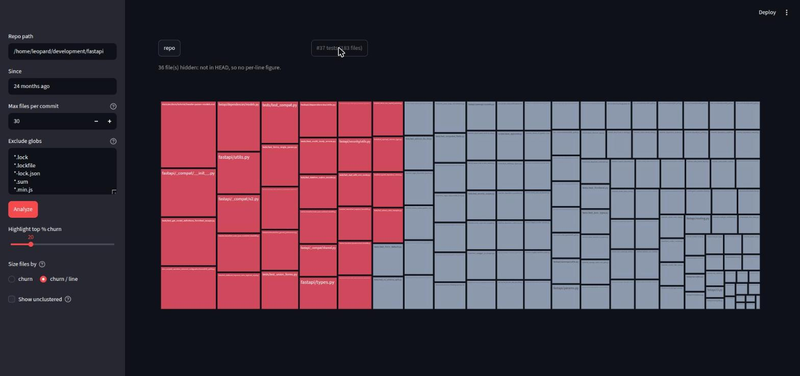
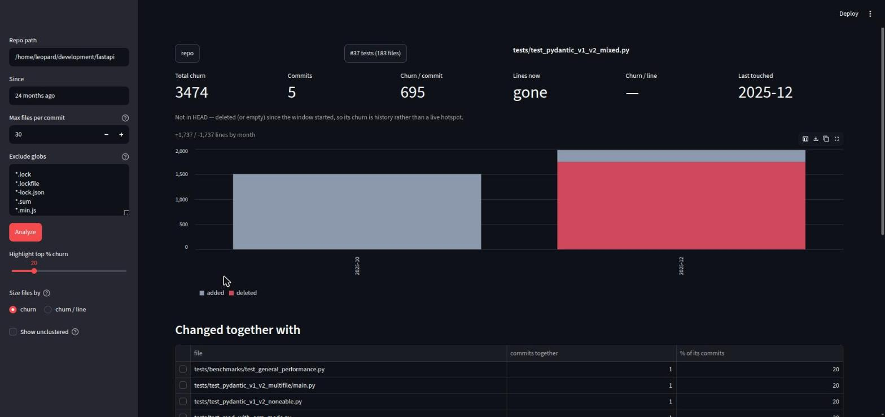

# churn-analytics

Find the files in a git repo that **change together**, and drill into why.

Raw churn (lines added + deleted) tells you which files are big and noisy. It doesn't tell you which files are *coupled* — the ones where touching A always means touching B, D and F. That coupling is what makes changes expensive, and it doesn't show up in any per-file metric.

This tool builds a co-change graph from `git log`, runs community detection over it, and gives you three screens: **clusters → files → per-file report**.

All screenshots below are [FastAPI](https://github.com/fastapi/fastapi) over a 24-month window — 16,032 file-commit rows across 3,760 files.



## Install

```bash
git clone https://github.com/muthuspark/churn-analytics
cd churn-analytics
uv venv && uv pip install -r requirements.txt
.venv/bin/streamlit run app.py
```

Or with plain pip:

```bash
python -m venv .venv && .venv/bin/pip install -r requirements.txt
.venv/bin/streamlit run app.py
```

Opens on <http://localhost:8501>. Put an absolute path to any local git repo in the sidebar and press Enter. Read-only — it never writes to the repo you point it at.

## How it works

1. **`git log --numstat`** over the window you pick → one row per (file, commit) with lines added and deleted.
2. **Co-change graph** — every pair of files in the same commit gets an edge; the weight is the number of commits they shared. Commits touching more than *max files per commit* are skipped.
3. **Louvain community detection** (`networkx`, `seed=0`) over that graph → clusters. Files that never co-changed land in `unclustered`.
4. **Line counts at HEAD** via one `git grep -I -c '' HEAD` → churn density.

Two git calls total, regardless of repo size, and the result is cached with `st.cache_data`.

## The three screens

### 1. Clusters

Box **area** is total churn. Box **colour** is how many top-level modules the cluster spans — `1` is self-contained, dark red reaches across the codebase. That pairing is the point: a big pale box is a lot of work in one place; a small dark box is coupling that crosses module boundaries. In the screenshot above, `#44 .github (61 files)` is small but spans 16 modules — CI config that every part of the repo has to care about.

### 2. Files in a cluster



The files in one cluster, sized by churn, red for the top 20% (tunable). This is FastAPI's Pydantic v1→v2 migration falling out of the data on its own: `fastapi/routing.py` and `fastapi/_compat*` sitting next to `tests/test_pydantic_v1_v2_*`. Nobody labelled that cluster — it's just what changed together.

### 3. Per-file report



| Metric | Reads as |
|---|---|
| Total churn | lines added + deleted in the window |
| Commits | how many commits touched it |
| Churn / commit | small = fiddly hotspot you keep poking; huge = rewrites or file moves |
| Lines now | size at HEAD, or `gone` if deleted |
| Churn / line | **effective rewrites** — `10` means the file has been replaced about ten times over |
| Last touched | still live, or historical |

Then:

- **added vs deleted by month** — growing (added ≫ deleted), being dismantled (deleted ≫ added), or churning in place (roughly equal). Same total churn, very different stories.
- **Changed together with** — the co-change partners, with what share of *this file's* commits each one appears in. Click a row to jump to that file.
- **Commits** — date, sha, added, deleted, subject. Connects the numbers to what actually happened.



## Usage notes

### Exclude generated files first

This matters more than any other setting. The default list covers lockfiles, `dist/`, `build/`, `node_modules/`, minified JS and friends — but every repo has its own generated output, and it will dominate until you exclude it.

Two reasons it wrecks the analysis:

- **It drowns real churn.** FastAPI's `docs/en/data/topic_repos.yml` and `people.yml` are bot-regenerated, and they take the #2 and #3 raw-churn spots in the whole repo.
- **It fakes coupling.** One dependency bump touches every module's lockfile in a single commit, so the graph concludes every module is tightly coupled to every other one.

Add your own patterns to the **Exclude globs** box (one glob per line) and press Ctrl+Enter.

### Tune `max files per commit`

Commits touching more files than this are ignored when building the graph. A mass rename or a formatting sweep across 400 files would otherwise create ~80,000 edges saying "all of this is coupled" — true, and useless.

It's also what keeps the pipeline fast, since pairs are O(n²) per commit. Raise it if your team lands genuinely large feature commits; lower it if the clusters look like mush.

### Size files by churn / line



Raw churn ranks big files highest just for being big. Per-line ranks by how many times a file has effectively been rewritten. On FastAPI the two orderings disagree almost completely:

```
TOP BY RAW CHURN                                  churn   lines  density
tests/test_include_router_defaults_overrides.py   12755    7304      1.7
docs/en/data/topic_repos.yml                       7968     496     16.1
docs/en/data/people.yml                            6758     774      8.7
fastapi/routing.py                                 4520    6447      0.7

TOP BY DENSITY (>=100 lines)                      churn   lines  density
docs/en/data/topic_repos.yml                       7968     496     16.1
docs/en/data/people.yml                            6758     774      8.7
docs/en/data/github_sponsors.yml                   2573     349      7.4
tests/.../test_request_form_models/test_...py      1034     184      5.6
```

`fastapi/routing.py` is the clearest case. Raw churn puts it in the repo's top four — it's the largest box in the churn view. At **0.7 churn per line** across 6,447 lines it isn't a hotspot at all, just a large file being maintained. Compare the density screenshot above with the churn view: `routing.py` shrinks to a sliver.

Files missing from HEAD are dropped from this view (with a count shown) rather than sized as if they were still live code.

### Deleted files

32% of the files in FastAPI's 24-month window no longer exist at HEAD. They still carry churn, so they still appear in the churn view — flagged rather than silently mixed in.



`tests/test_pydantic_v1_v2_mixed.py` has 3,474 churn over 5 commits, added in 2025-10 and deleted in 2025-12. Real work, but nothing you can act on today — and the added/deleted chart shows the whole life cycle at a glance.

### Show unclustered

Off by default. Files that never co-changed inside the commit-size cap are usually most of the repo, and as one giant box they crowd out every real cluster. Turn it on to see how much of the repo the clustering actually covered.

### Cluster ids are not stable

Louvain runs with a fixed seed, so the same input gives the same output — but change the date window, the excludes, or the commit cap and the numbering shifts. `#3` before a re-run is not `#3` after. Pressing Analyze clears the drill-down for exactly this reason.

## Files

| File | What's in it |
|---|---|
| `churn.py` | the pipeline — git parsing, co-change graph, clustering, density. No streamlit import, so it's usable on its own. |
| `app.py` | the Streamlit UI and navigation |
| `test_app.py` | navigation checks via `streamlit.testing.v1.AppTest` |

## Using the pipeline directly

`churn.py` has no UI dependency:

```python
import churn

clusters, files, commits, edges = churn.analyze(
    "/path/to/repo", since="24 months ago", max_files_per_commit=30
)

# the worst coupling, by modules spanned
print(clusters.nlargest(5, "num_modules"))

# most-rewritten live files
live = files[files.lines >= 100]
print(live.nlargest(10, "density")[["path", "churn", "lines", "density"]])

# what changes with a given file
print(edges[edges.a == "fastapi/routing.py"].nlargest(10, "weight"))
```

Returns four dataframes:

- `clusters` — `cluster_id, total_churn, num_files, total_commits, dominant_module, num_modules, label`
- `files` — `path, churn, added, deleted, commits, last_month, cluster_id, module, lines, density`
- `commits` — `path, sha, date, subject, added, deleted, churn` (one row per file per commit)
- `edges` — `a, b, weight` (both directions, so filtering on `a` is enough)

## Checks

```bash
.venv/bin/python churn.py                    # pipeline self-check
.venv/bin/python test_app.py /path/to/repo   # UI navigation check
```

Both print `ok`.

## Known limits

- **Renames split history.** Git's rename notation is normalised to the post-rename path, but churn before and after a rename lands on two separate nodes. Fixing it properly needs `git log --follow` per path — one git call per file.
- **Churn is a proxy, not a verdict.** A file with high churn may be under active healthy development. The tool surfaces candidates; you still have to look.
- **No line-level detail.** `--numstat` gives per-file counts only, so there's no honest way to show *where* inside a file the changes concentrate. Churn over time plus the commit list is the substitute.
- **Editing `churn.py` while the app runs** won't invalidate `st.cache_data` — it hashes the decorated function, not the callee. Restart the server after pipeline changes.
